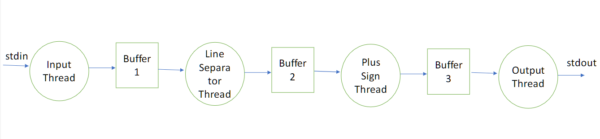

## Instruction
Write a program that creates 4 threads to process input from standard input as follows

1. Thread 1, called the Input Thread, reads in lines of characters from the standard input.
2. Thread 2, called the Line Separator Thread, replaces every line separator in the input by a space.
3. Thread 3, called the Plus Sign thread, replaces every pair of plus signs, i.e., "++", by a "^".
4. Thread 4, called the Output Thread, write this processed data to standard output as lines of exactly 80 characters.

Furthermore, in your program these 4 threads must communicate with each other using the Producer-Consumer approach.

## How to compile your code using gcc to create an executable file
```sh
gcc --std=gnu99 -pthread -o line_processor main.c
```
## Example of run program commands
```sh
./line_processor < input.txt > output.txt
```
## Multi-Threading Requirements


Pipeline of threads that gets data from stdin, processes it and displays it to stdout

* Each pair of communicating threads must be constructed as a producer/consumer system.
* If a thread T1 gets its input data from another thread T0, and T1 outputs data for use by another thread T2, then
  - T1 acts as a consumer with respect to T0 and T0 plays the role of T1’s producer
  - T1 acts as a producer with respect to T2 and T2 plays the role of T1’s consumer
* Thus each thread in the interior of the pipeline (i.e., the Line Separator and Plus Sign threads) will contain both producer code and consumer code.
* Each producer/consumer pair of threads will have its own shared buffer. Thus, there will be 3 of these buffers in your program, each one shared only by its producer and consumer.
* You must use condition variables for coordination.
* Your program must never sleep.
* If you size your buffers to hold 50 lines of 1000 characters each, you can model the problem as Producer-Consumer with unbounded buffers which will make your program simpler.
  - Recall that unbounded buffers are never full, though they can be empty.